# 👋 Hi, I'm Rohan Maji

### Software Developer · AI Integration · Full-Stack Engineering · Computer Vision

  
  
  

  <strong>I build software that connects reliable backend engineering with practical AI.</strong> 
  From Spring Boot applications and secure REST APIs to computer-vision research and AI-powered systems,
  I enjoy turning difficult technical problems into useful products.

---

## 🧭 About Me

I am a **software developer with AI integration experience** and a background spanning **full-stack development, computer vision, test automation, Linux systems administration, and security**.

My strongest engineering interests sit at the intersection of:

- 🤖 **AI-powered software** — LLM integration, local models, document intelligence, matching/ranking pipelines and AI-assisted workflows
- ☕ **Backend engineering** — Java, Spring Boot, Spring Security, Hibernate/JPA, REST APIs, authentication and RBAC
- 🧠 **Computer vision & deep learning** — PyTorch, Hugging Face, OpenCV, Transformers, Vision Mamba and facial-expression recognition
- 🌐 **Full-stack development** — React, Node.js/Express, Thymeleaf, Tailwind CSS and relational databases
- 🧪 **Automation & quality engineering** — Selenium, TestNG, Cucumber, Postman, Rest-Assured, CI/CD and GenAI-assisted testing
- 🐧 **Systems & infrastructure** — Linux/Unix, networking, Bash/Python scripting, NIS, NFS and SSH

> **Current positioning:** Software Developer | AI Integration | Backend / Full-Stack Engineering | Computer Vision

---

## 🚀 What I Build

<table>
<tr>
<td width="50%" valign="top">

### 🤖 AI-Native Applications

I built an AI job-screening system that combines document parsing, candidate/job matching, ranking, interview workflows, local LLM inference through **Ollama**, and an **OpenAI API fallback**.

</td>
<td width="50%" valign="top">

### ☕ Backend Systems

My Java work includes a full-stack job portal using **Spring Boot 3, Spring MVC, Spring Security, Hibernate/JPA, MySQL and RESTful APIs**, with recruiter/applicant workflows.

</td>
</tr>
<tr>
<td width="50%" valign="top">

### 🧠 Computer Vision Research

My MambaFER research combines **IR50 + MobileFaceNet**, multiscale features, window-based cross-attention, fusion blocks and **8 Vision Mamba blocks** for facial-expression recognition.

</td>
<td width="50%" valign="top">

### 🛡️ Secure Full-Stack Engineering

Trackline demonstrates **JWT authentication, project-scoped RBAC, Express middleware enforcement, React, PostgreSQL/Sequelize and REST APIs** with permissions enforced server-side.

</td>
</tr>
</table>

---

## ⭐ Featured Projects

### 01 · 🔐 Semaphore — Privacy-First File Transfer

A privacy-first file-transfer web app that can move files between two devices using **sound, light, or an online WebRTC link**.

- OFDM audio modem with synchronization and error-corrected frames
- Screen/camera light transfer and QR-based pairing
- WebRTC data-channel link mode
- **X25519 key exchange + XChaCha20-Poly1305** end-to-end encryption
- Chunking, compression, CRC32 verification and retransmission
- React 18 + TypeScript + Vite + Zustand + libsodium + PWA

> **Repository status:** This project is **private/unreleased and not intended for public release** at present.

🔗 [View repository →](https://github.com/rohanmj99/semaphore)

---

### 02 · 🛤️ Trackline — Team Task Manager

A full-stack project/task manager with **real server-side role-based access control**.

- React + Vite frontend
- Express REST API
- PostgreSQL + Sequelize
- JWT authentication
- Project-scoped Admin/Member roles
- Authorization enforced in backend middleware
- Tailwind CSS UI

**Stack:** React · Vite · Node.js · Express · PostgreSQL · Sequelize · Tailwind CSS · JWT

🔗 [View Trackline →](https://github.com/rohanmj99/team-task-manager)

---

### 03 · 🧠 MambaFER — Efficient Facial Expression Recognition

My flagship AI/research project using **Vision Mamba / state-space modeling** for facial-expression recognition.

- **IR50** facial feature extractor + **MobileFaceNet** landmark detector
- Multiscale feature extraction with pairwise **window-based cross-attention**
- Feature fusion followed by **8 Vision Mamba blocks**
- **91.2% Top-1 accuracy on RAF-DB** in my CV
- Automated experiments across learning rate, dropout, drop path, optimizer momentum and LR schedulers

**Stack:** Python · PyTorch · TensorFlow · Hugging Face · Transformers · OpenCV · NumPy · Pandas · Scikit-learn · Matplotlib · Seaborn · Deep Learning · Machine Learning

📄 **[Research Paper →](https://drive.google.com/file/d/1s3DfC2Boc_LzDwWYaktyT8CnSOeUsj5h/view?usp=sharing)**

> **Model release note:** The trained MambaFER model is **not for public release**. The paper is provided for reference and research context.

🔗 [View MambaFER repository →](https://github.com/rohanmj99/MambaFER)

---

### 04 · 🤖 AI Job Screening System

An AI-assisted recruitment workflow that analyzes job descriptions and resumes, scores candidate/job fit, ranks candidates and supports interview scheduling.

- Multi-agent AI architecture
- PDF/DOCX document parsing
- Local inference with **Ollama**
- **OpenAI API** fallback
- Flask web layer + SQLAlchemy ORM
- PostgreSQL persistence

**Stack:** Python · Flask · SQLAlchemy · PostgreSQL · Ollama · OpenAI API · Document AI · LLM integration

🔗 [View AI Job Screening →](https://github.com/rohanmj99/AI-Job-Screening)

---

### 05 · ☕ Job Portal Web Application

A full-stack Java application built around secure recruiter/applicant workflows.

- Spring Boot 3 + Spring MVC
- Spring Security + role-based authentication
- Hibernate/JPA + MySQL
- Recruiter job posting and applicant job search/application flows
- CRUD operations and RESTful APIs
- MVC architecture with Maven-based development

**Stack:** Java · Spring Boot · Spring MVC · Spring Security · Hibernate/JPA · Thymeleaf · REST APIs · MySQL · Maven

🔗 [Explore all repositories →](https://github.com/rohanmj99?tab=repositories)

---

## 🧰 Technical Skills

### Languages

### Backend & APIs

### AI / ML / Computer Vision

### Generative AI

### Frontend

### Testing & Automation

### DevOps & Engineering Tools

### Systems & Networking

### Databases

---

## 🧪 Engineering Focus

<strong>🔐 Security & Access Control</strong>

Authentication and authorization are recurring themes in my software work: Spring Security, JWT-based authentication, role-based access control, project-scoped permissions and server-side authorization enforcement.

<strong>⚙️ AI Integration</strong>

I am especially interested in making AI useful inside real software systems — not just training models. My projects include LLM fallback strategies, document intelligence, matching/ranking pipelines, multi-agent workflows and GenAI-assisted testing.

<strong>🧠 Research to Application</strong>

My MambaFER work gives me experience moving from research concepts — state-space models, multiscale representations and attention mechanisms — into measurable application performance.

<strong>🧰 Quality & Delivery</strong>

I have hands-on experience with UI/API automation, Agile testing workflows, bug lifecycle management, CI/CD pipelines, Docker-based test environments and Git-based collaboration.

---

## 📈 GitHub Activity

  
  

---

## 🐍 Contribution Snake

  <picture>
    <source media="(prefers-color-scheme: dark)" srcset="https://raw.githubusercontent.com/rohanmj99/rohanmj99/output/github-contribution-grid-snake-dark.svg" />
    <source media="(prefers-color-scheme: light)" srcset="https://raw.githubusercontent.com/rohanmj99/rohanmj99/output/github-contribution-grid-snake.svg" />
    
  </picture>

> The animation is generated automatically from my GitHub contribution graph and refreshed by GitHub Actions.

---

## 🎓 Education

### AUG 2023 – MAY 2025
**Master of Technology in Computer Science** · University of Hyderabad · **8.30 CGPA** · [Final Degree](https://drive.google.com/file/d/1H9UZ29YUzXfVNT5Bl6suERxjDOAvUV02/view?usp=sharing)

Relevant subjects: Banking Technology and Payment Systems, System Security, Network Security, Biometrics, Virtualization, Cryptography, Advanced Operating Systems.

### SEP 2018 – JUNE 2022
**Bachelor of Engineering in Computer Science and Engineering** · Jadavpur University · **7.62 CGPA** · [Final Degree](https://drive.google.com/file/d/19oFXNPA0yYzSQBcYlY1bVsUP7wz97xR7/view?usp=sharing)

Relevant subjects: Software Engineering, Machine Learning, NLP, Deep Learning, AI, DBMS, Compiler Design, Computer Graphics, Computer Architecture, Hardware Design, Microprocessor.

---

## 💼 Internships & Experience

### MAY 2025 – SEPT 2025 · QEA Automation Engineer — Cognizant

**Virtual Internship** · [Internship Completion Letter](https://drive.google.com/file/d/1GjPjKkTazYMo_uUxRUzXnek_pUH0tp-U/view?usp=sharing)

Java · Selenium · Cucumber · TestNG · Apache POI · Postman · Rest-Assured · Maven · Jira · Zephyr · Jenkins · Git · Docker · GenAI

Developed and executed manual and automated test suites using hybrid frameworks for front-end UI and back-end APIs across four Agile sprints. Managed the full testing and bug lifecycle, integrated automated tests into CI/CD, containerized test environments and applied Generative AI to accelerate testing.

### AUGUST 2024 – JUNE 2025 · Student System Administrator — AI Lab, SCIS, University of Hyderabad

[Service Certificate](https://drive.google.com/file/d/1VNrDq9Ih9vDR15HDz8IS4uzYgls2TWiV/view?usp=sharing)

Unix/Linux · Windows · NIS · NFS · TCP/IP · DNS · DHCP · Bash · Python · SSH

Managed and maintained 100+ Linux-based desktops in a high-traffic research lab. Configured and deployed NIS and NFS servers and clients for centralized authentication and file sharing, and provided critical live support during examination periods.

---

## 📬 Contact

I am interested in **Software Development, Backend Engineering, AI Engineering, Full-Stack Development and AI-integrated product roles**.

  

### 💡 Build useful things. Automate the boring parts. Integrate AI where it creates real value.

